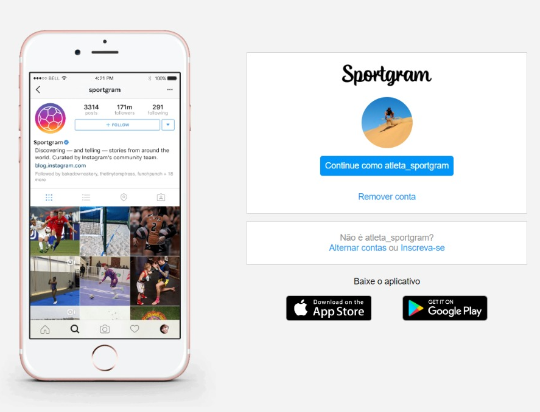

# Recriando a página do Instagram

Projeto final do **Módulo II - Fundamentos Web com HTML e CSS** da Digital Innovation One.

O principal objetivo do projeto final é aplicar todos os conceitos de HTML e CSS aprendidos até então, com foco principal em flexbox e responsividade.

O projeto recria a página de login do Instagram. Apenas para variar um pocuo, nesse projeto eu resolvi criar uma réplica, "Sportgram", que seria um Instagram exclusivo para atletas.

[Clique aqui](https://github.com/SpruceGabriela/instagram-dio) para ver o repositório do projeto usado como referência no curso.
[Clique aqui](https://yohanaff.github.io/dio-recriando-a-pagina-inicial-do-instagram/) para ver o projeto finalizado.

